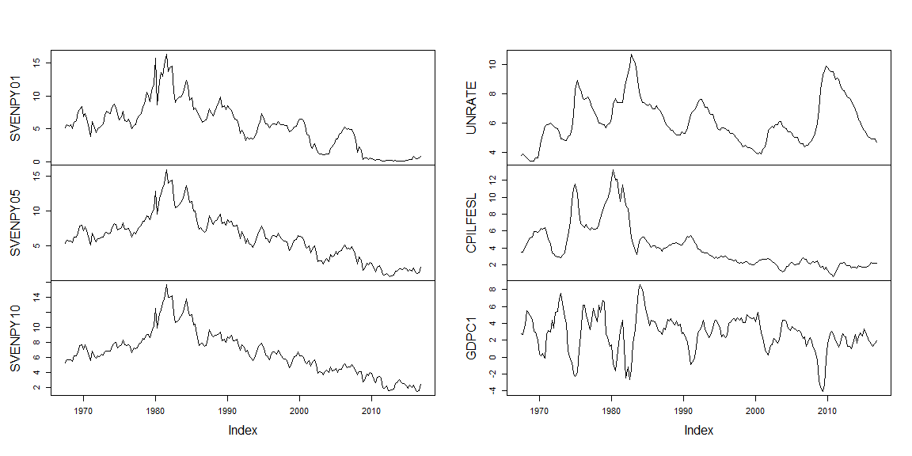
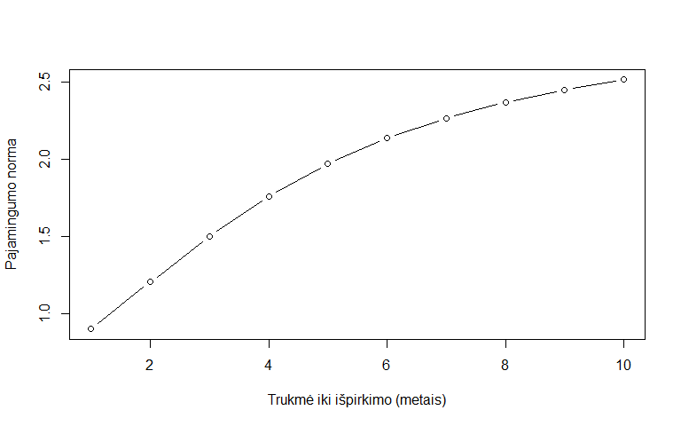
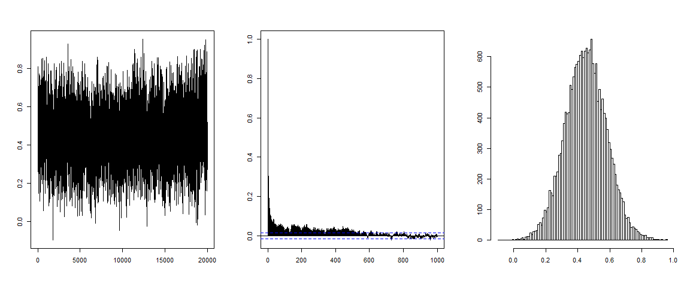
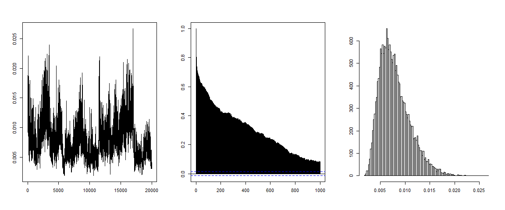
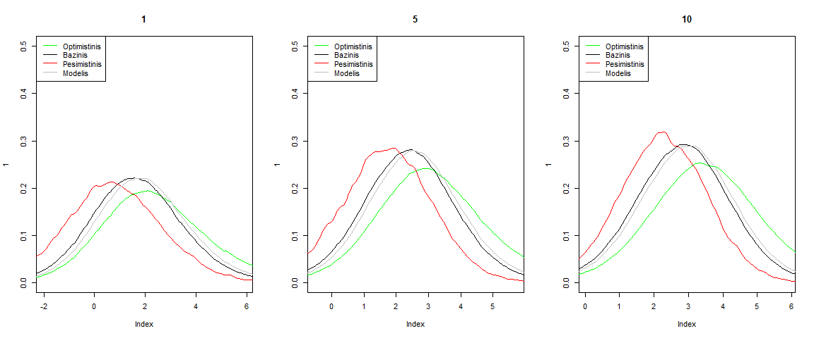
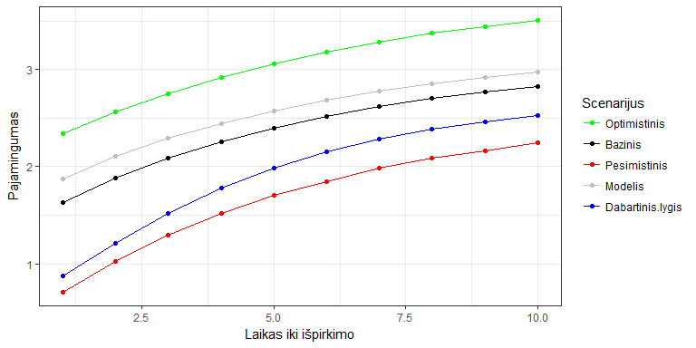
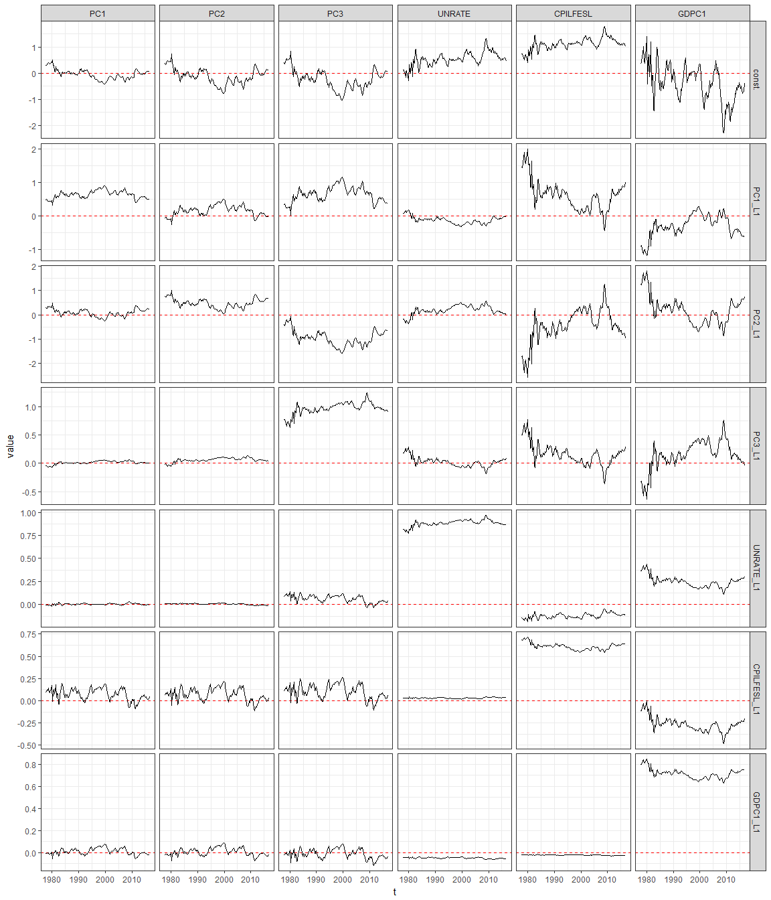
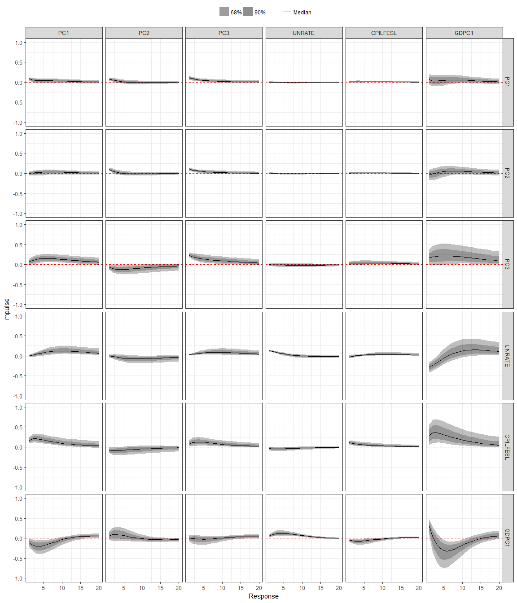

Užduotis
========

Rasti modelį, kuris susietų JAV ekonominius duomenis ir JAV vyriausybės vertybinių popierių (VVP) pajamingumų kreivę. Ištirti ekonominių duomenų įtaką pajamingumų kreivės formai ir rasti sąlygines prognozes skirtingiems ekonominiams scenarijams.

Duomenys
========

Naudojame ketvirtinius duomenis nuo 1967K2 iki 2016K4. Tyrimui naudojame šias laiko eilutes:

-   `UNRATE` - JAV nedarbo lygis. Asmenys vyresni nei 16 metų, neturintys darbo, galintys bei pasirengę dirbti ir aktyviai ieškantys darbo. Procentiniais punktais nuo visos darbo jėgos. Pakoreguotas atsižvelgiant į sezoniškumą.
-   `CPILFESL` - JAV infliacijos lygis procentiniais punktais. Visos vartojimo prekės išskyrus maisto ir energetikos sektorius. Pakoreguotas atsižvelgiant į sezoniškumą.
-   `GDPC1` - realus (atėmus infliaciją) BVP. Metinis pokytis procentiniais punktais. Pakoreguotas atsižvelgiant į sezoniškumą.
-   `SVENPY[x]` - \[x\] metų trukmės JAV vyriausybės obligacijų pajamingumo norma procentiniais punktais.

Ekonominius duomenis galima rasti St. Louis Fed puslapyje (<https://fred.stlouisfed.org>). Pajamingumo kreivių šaltinis: Federal Reserve (<http://www.federalreserve.gov/pubs/feds/2006>).

Naudotos laiko eilutės pateiktos Pav. Dešinėje pavaizduoti ekonominiai duomenys, o kairėje keli pajamingumų kreivės taškai.

Pajamingumo kreivė
------------------

Skirtingų trukmių vertybinų popierių pajamingumai yra stipriai koreliuoti (žr. Pav) ir tipiškai didėja, didėjant trukmei iki išpirkimo. Skirtingų trukmių obligacijų gali būti daug, todėl dažnai modeliuojant naudojama pajamingumų kreivė, kuri nusako pajamingumo normą skirtingos trukmės vertybiniams popieriams. Tipinę kreivės formą galima pamatyti pav. Mes analizėje naudojame 1, 2, ..., 10 metų fiksuotus kreivės taškus.

Dažnai pajamingumo kreivė yra aprašoma trimis faktoriais: lygiu, statumu ir kreivumu. Pvz. Nelson ir Siegel ([1987](#ref-NelsonSiegel)) pasiūlė tokį kreivės faktorių išskyrimą:

$$ y\_t(m) = \\beta^L\_t + \\beta^S\_t \\left(\\frac{1-\\exp(-m \\lambda)}{m\\lambda}\\right) + \\beta^C\_t \\left(\\frac{1-\\exp(-m \\lambda)}{m\\lambda} - \\exp(-m \\lambda)\\right).$$
 Čia *m* žymi trukmę iki obligacijos išpirkimo, *y**t* - pajamingumo lygį, o *λ* parametras, kuris nusako kurioje kreivės vietoje maksimizuojamas kreivumas. Tai maždaug atitinka PCA rezultatus (pirmos trys didžiausios variacijos komponentės). Tokia praktika motyvavo FAVAR modelio pasirinkimą.

Trumpai apie TVP-FAVAR modelį
=============================

Analizei pasirinkome faktoriais papildytą vektorinės autoregresijos su laike kintančiais parametrais modelį (TVP-FAVAR). Tokį pasirinkimą lėmė keli veiksniai. Kaip minėjome visą pajamingumo kreivę gan gerai aprašo trys faktoriai. Kita vertus, kadangi nagrinėjome ilgą laikotarpį yra gan realu, kad per tą laikotarpį ekonominiai sąryšiai galėjo kisti, todėl pasirinkome modelį su laike kintančiais parametrais. Modelis užrašomas trimis lygtimis:

*y**t* = *Λ**F**t* + *r**t*;   *r**t* ∼ *N*(0, *R*)
*F**t* = *Z**t**β**t* + *ϵ**t*;   *ϵ**t* ∼ *N*(0, *H*)
*β**t* + 1 = *β**t* + *u**t*;   *u**t* ∼ *N*(0, *Q*),
 *Z**t* žymi matricą
*Z**t* = \[1, *F**t* − 1, *F**t* − 2, ..., *F**t* − *p*\]⊗*I**n*
 Mūsų nagrinėjamu atveju
*y**t* = (SVENPY01*t*, ..., SVENPY10*t*, UNRATE*t*, CPILFESL*t*, GDPC1*t*),
*F**t* = (*F**t*1, *F**t*2, *F**t*3, UNRATE*t*, CPILFESL*t*, GDPC1*t*),
 ir
$$ \\Lambda = \\left( \\begin{array}{cccccc}
\\lambda\_{1;1} & \\lambda\_{1;2} & \\lambda\_{1;3} & 0 & 0 & 0 \\\\
... & ... & ... & ... & ... & ... \\\\
\\lambda\_{10;1} & \\lambda\_{10;2} & \\lambda\_{10;3} & 0 & 0 & 0 \\\\
0  & 0 & 0 & 1 & 0 & 0 \\\\
0  & 0 & 0 & 0 & 1 & 0 \\\\
0  & 0 & 0 & 0 & 0 & 1 \\\\
\\end{array} \\right). $$
 Taip pat darome prielaidą, kad *R* diagonalinė matrica (visa tarpusavio priklausomybė atsiranda tik iš fakorių).

Apriori skirstiniai
-------------------

Parametrams *Λ* ir *R* pasirinkome Normalųjų-Atvirkštinį Gama (angl. *normal-inverse gamma*) priorą, kadangi laikant kitus parametrus žinomais pirma lygtis nusako tiesinės regresijos modelį. Šiuo atveju pasirinkome

*R**i**i* ∼ *I**G*(0.01, 1);  *λ**i**j* ∼ *N*(0, 1).
 *F**t* ir *Λ* pradinės reikšmės gautos iš PCA, tačiau išmėginome ir kitas pradines reikšmes.

Modelio parametrams *β*0, *H* ir *Q* pasirinkome patogų ir gan bendrą nepriklausomą Normalųjų-Wishart (angl. *independent Normal-Wishart*) apriorinį skirstinį, t.y.
*p*(*β*1, *H*−1, *Q*−1)=*p*(*β*1)*p*(*H*−1)*p*(*Q*−1),
 kur
$$\\beta\_1 \\sim N(\\underline{\\beta}, \\underline{V}\_{\\beta}) ,$$
$$H^{-1} \\sim W(\\underline{S}^{-1}, \\underline{\\nu}), $$
$$Q^{-1} \\sim W(\\underline{Q}^{-1}, \\underline{\\nu}\_Q). $$

Apriorų hiperparametrų nustatymui sekėme Primiceri ([2005](#ref-Primiceri2005)) ir juos pasirenkome naudodami OLS sprendinį pirmiems 40 stebėjimų (*τ* = 40), t.y. nuo 1967K2 iki 1977K1. Pats FAVAR-TVP modelio skaičiavimas pradedamas nuo 1977K2. Hiperparametrai nustatomi naudojant OLS sprendinį *β**O**L**S* ir kovariacijų matricą *V*(*β**O**L**S*). Šiam tyrimui pasirinkome
$$\\underline{\\beta} = \\beta\_{OLS}; \\quad \\underline{V}\_{\\beta} = 4V(\\beta\_{OLS}); \\quad  \\underline{\\nu} = n +1; \\quad \\underline{S} = I\_n; \\quad \\underline{\\nu}\_Q = \\tau; \\quad \\underline{Q} = 10^{-6} \\tau V(\\beta\_{OLS})$$
 Reiktų pastebėti, kad pasirinkome labai mažas kovariacijas matricoje $\\underline{Q}$. Tai atspindi mūsų a priori požiūrį, kad parametrai *β**t* turėtų būti mažai kintantys.

Nepriklausomas normaliojo-Wishart bei normaliojo-atv. gama aprioras leidžia sukonstruoti paprastą MCMC algoritmą, kuris paeiliui generuoja *p*(*β*1|*F**T*, *β**T*, *H*), *p*(*H*−1|*F**T*, *β*1, *β**T*), *p*(*Q*−1|*F**T*, *β*1, *β**T*), *p*(*β**T*|*F**T*, *β*1, *H*, *Q*), *p*(*Λ*|*y**T*, *F**T*, *R*), *p*(*R*|*y**T*, *F**T*, *Λ*) ir *p*(*F**T*|*y**T*, *R*, *Λ*, *H*). Plačiau apie MCMC algoritmą galima rasti Koop ir Korobilis ([2010](#ref-KoopKorobilis2010)), Blake, Mumtaz, ir others ([2012](#ref-blake2012applied)), Bernanke, Boivin, ir Eliasz ([2004](#ref-Bernanke2004)) ir Ellis, Mumtaz, ir Zabczyk ([2014](#ref-EllisMumtaz2014)).

Verta paminėti, kad yra keliatas algoritmų skirtų *p*(*β**T*|*F**T*, *β*1, *H*, *Q*) generavimui. Mes išmėginome du iš jų Carter ir Kohn ([1994](#ref-CC1994)) ir Durbin ir Koopman ([2002](#ref-DK2002)). Abu algoritmai grąžina panašius rezultatus, tačiau mūsų Durbin ir Koopman ([2002](#ref-DK2002)) implementacija veikia šiek tiek greičiau.

Kita a priori prielaida modeliuojant ekonominius duomenis dažnai yra, kad nagrinėjamos laiko eilutės yra stacionarios. Mes taip pat darome šią prielaidą ir ją implementuojame, naudodami priėmimo-atmetimo (angl. *accept-reject*) žingsnį MCMC algoritme. Plačiau apie tai Cogley ir Sargent ([2005](#ref-CogleySargent2005)).

VAR lagų skaičiaus pasirinkimas
-------------------------------

VAR modelio lagų skaičiui nustatyti naudojome OLS sprendinį kreivės faktoriams (atlikus PCA) ir ekonominiams duomenims, bei dažnai praktikoje naudojamus informacijos kriterijus: AIC, HQ, SC, FPE. Optimalūs lagų skaičiai pagal kiekvieną iš kriterijų pateikiami lentelėje. HQ ir SC kriterijai siūlo atitinkamai du arba vieną lagą, o kiti du daug didesnius. Dėl naudojamo MCMC algoritmo skaičiavimų intensyvumo pasirinkome tolesnėje analizėje naudoti *p* = 1, t.y. TVP-FAVAR(1) modelį.

|  AIC(n)|  HQ(n)|  SC(n)|  FPE(n)|
|-------:|------:|------:|-------:|
|      10|      2|      1|      10|

MCMC algoritmo rezultatai
=========================

Konvergavimas
-------------

Posterioro radimui atlikome 70000 MCMC algoritmo žingsnių, iš kurių atmetėme pirmus 20000. Konvergavimas patikrintas algoritmą iniciajavus su skirtingomis pradinėmis reikšmėmis, ir sulyginus gautus rezultatus. Taip pat grafiškai patikrinti autokoreliacijos bei simuliacijos histogramų grafikai. Dėl didelio skaičiaus pateikiame šiuos grafikus tik keliems parametrams. pav. pateikiame grafikus `UNRATE` faktorių lygties konstantai paskutiniam stebėtam periodui (2016K4) *β*2016*K*44; 1, o pav. - analogiškus grafikus parametrui *q*11.

Parametrų skirstiniai ir įverčiai
---------------------------------

 pav. pavaizduota beta posteriorų vidurkių kitimas laike, o lentelėje beta parametrų įverčiai paskutiniam stebėtm periodui. Taip pat lentelėje pateikėme H kovariacijų matricos parametrų posteriorų vidurkius. Dėl didelio kiekio parametrų kiekio, vien iš jų sunku suprasti nagrinėjamų duomenų eilučių sąryšius, todėl tokiais atvejais dažnai naudojama impulso-atsako (angl. *impulse-response*) funkcijos. 2016m. 4 ketv. jos pavaizduotos pav. Matome kai kuriuos sąryšius, kurių ir buvo galima laukti. Pvz. infliacijos šokas paveikia pajamingumų kreivę - didėja lygio (PC1) ir kreivumo (PC3) faktoriai, o statumo (PC2) faktorius mažėja.

|          |  const.|  PC1\_L1|  PC2\_L1|  PC3\_L1|  UNRATE\_L1|  CPILFESL\_L1|  GDPC1\_L1|
|----------|-------:|--------:|--------:|--------:|-----------:|-------------:|----------:|
| PC1      |    0.06|     0.50|     0.24|     0.00|        0.00|          0.02|      -0.02|
| PC2      |    0.11|    -0.02|     0.67|     0.04|       -0.01|          0.01|      -0.03|
| PC3      |    0.07|     0.38|    -0.65|     0.94|        0.03|          0.03|      -0.05|
| UNRATE   |    0.56|    -0.03|     0.04|     0.07|        0.87|          0.04|      -0.05|
| CPILFESL |    1.11|     0.87|    -0.80|     0.22|       -0.11|          0.64|      -0.02|
| GDPC1    |   -0.70|    -0.61|     0.64|     0.02|        0.28|         -0.23|       0.75|

|          |   PC1|   PC2|   PC3|  UNRATE|  CPILFESL|  GDPC1|
|----------|-----:|-----:|-----:|-------:|---------:|------:|
| PC1      |  0.03|  0.01|  0.02|    0.00|      0.00|   0.03|
| PC2      |  0.01|  0.03|  0.03|    0.00|      0.00|   0.01|
| PC3      |  0.02|  0.03|  0.14|    0.00|      0.01|   0.06|
| UNRATE   |  0.00|  0.00|  0.00|    0.03|     -0.01|  -0.05|
| CPILFESL |  0.00|  0.00|  0.01|   -0.01|      0.02|   0.03|
| GDPC1    |  0.03|  0.01|  0.06|   -0.05|      0.03|   0.67|

Prognozės ir scenarijų analizė
------------------------------

Turint posterioro skirtinio simuliacijas gauti prognozių skirstinių simuliacijas nesudėtinga. Įvertinus parametrus procesas toliau tesiamas generuojant paklaidas pagal gautas kovariacijų matricas pasirinktą kiekį periodų. Mes pasirinkome 4 periodų (vienų metų) horizontą.

Kaip minėjome užduoties aprašyme mus domina ne tik modelio implikuojma, bet ir sąlyginė prognozė prie tam tikrų ekonomikos scenarijų. Šias sąlygines prognozes randame "pataisydami" prognozės simuliacijas taip, kad jų momentai tenkintų nurodytus apribojimus ir būtų kiek įmanoma "arti" pradinio simuliuoto skirstinio pagal Kullback-Leibler informacijos kriterijų. Plačiau apie šį metodą galima rasti Robertson, Tallman, ir Whiteman ([2005](#ref-Robertson2005)).

Savo analizėje suformavome tris ekonomikos scenarijus: optimistinį, bazinį ir pesimistinį. Scenarijai suformuoti nurodant infliacijos, nedarbo lygio ir RGDP vidurkius po metų. Scenarijai gali būti formuojami įvariai, pvz. savo nuojauta ar ekonomistų prognozėmis. Mūsų suformuoti scenarijai pateikiami lentelėje. Nagrinėtų eilučių prognozių skirstiniai pateikiami pav. ir lentelėje. pav. pateikiame ir pačių pajamingumo kreivių prognozes. Gauti rezultatai intuityvūs: gerėjant ekonominiai situacijai pajamingumų kreivė kyla į viršų, o blogėjant atvirkščiai - pajamingumai mažėja.

|              |  UNRATE|  CPILFESL|  GDPC1|
|--------------|-------:|---------:|------:|
| Optimistinis |     4.4|       3.2|   2.50|
| Bazinis      |     4.8|       2.5|   1.80|
| Pesimistinis |     5.4|       1.8|   1.25|

<table class="kable_wrapper">
<caption>
Prognozės simuliacijų kvantiliai skirtingais scenarijais
</caption>
<tbody>
<tr>
<td>
|     |  SVENPY01|  SVENPY03|  SVENPY05|  SVENPY07|  SVENPY10|
|-----|---------:|---------:|---------:|---------:|---------:|
| 5%  |     -0.86|     -0.10|      0.36|      0.64|      0.84|
| 50% |      2.34|      2.75|      3.06|      3.28|      3.51|
| 95% |      7.11|      6.76|      6.59|      6.51|      6.51|

</td>
<td>
|     |  SVENPY01|  SVENPY03|  SVENPY05|  SVENPY07|  SVENPY10|
|-----|---------:|---------:|---------:|---------:|---------:|
| 5%  |     -1.30|     -0.51|     -0.03|      0.26|      0.46|
| 50% |      1.63|      2.09|      2.40|      2.62|      2.83|
| 95% |      4.93|      4.88|      4.91|      4.98|      5.12|

</td>
<td>
|     |  SVENPY01|  SVENPY03|  SVENPY05|  SVENPY07|  SVENPY10|
|-----|---------:|---------:|---------:|---------:|---------:|
| 5%  |     -2.61|     -1.52|     -0.75|     -0.32|     -0.03|
| 50% |      0.70|      1.29|      1.70|      1.99|      2.24|
| 95% |      4.05|      4.01|      4.03|      4.12|      4.35|

</td>
<td>
|     |  SVENPY01|  SVENPY03|  SVENPY05|  SVENPY07|  SVENPY10|
|-----|---------:|---------:|---------:|---------:|---------:|
| 5%  |     -1.05|     -0.30|      0.15|      0.41|      0.60|
| 50% |      1.88|      2.29|      2.57|      2.78|      2.97|
| 95% |      5.30|      5.19|      5.17|      5.21|      5.33|

</td>
</tr>
</tbody>
</table>

\newpage

Priedas. Paveikslėliai
======================

VAR-TVP(1) beta parametrų medianų kitimas laike

Nuorodos į R/C++ kodą
=====================

Pagrindinė dalis kodo sudėta į `bayesVAR_TVP` paketą. Jį galima rasti: <https://github.com/GediminasB/bayesVAR_TVP>. Pačios ataiskaitos `Rmarkdown` kodas ir naudoti duomenys čia: <https://github.com/GediminasB/MIF_bayesVAR_tyrimas>

Literatūros sąrašas
===================

Bernanke, Ben S., Jean Boivin, ir Piotr Eliasz. 2004. „Measuring the Effects of Monetary Policy: A Factor-Augmented Vector Autoregressive (FAVAR) Approach“. NBER Working Papers 10220. National Bureau of Economic Research, Inc. <https://ideas.repec.org/p/nbr/nberwo/10220.html>.

Blake, Andrew P, Haroon Mumtaz, ir others. 2012. „Applied Bayesian econometrics for central bankers“. *Technical Books*. Centre for Central Banking Studies, Bank of England.

Carter, C. K., ir R. Kohn. 1994. „On Gibbs Sampling for State Space Models“. *Biometrika* 81 (3). \[Oxford University Press, Biometrika Trust\]: 541–53. <http://www.jstor.org/stable/2337125>.

Cogley, Timothy, ir Thomas J. Sargent. 2005. „Drifts and volatilities: monetary policies and outcomes in the post {WWII} {US}“. *Review of Economic Dynamics* 8 (2): 262–302. doi:[http://dx.doi.org/10.1016/j.red.2004.10.009](https://doi.org/http://dx.doi.org/10.1016/j.red.2004.10.009).

Durbin, J., ir S. J. Koopman. 2002. „A Simple and Efficient Simulation Smoother for State Space Time Series Analysis“. *Biometrika* 89 (3). \[Oxford University Press, Biometrika Trust\]: 603–15. <http://www.jstor.org/stable/4140605>.

Ellis, Colin, Haroon Mumtaz, ir Pawel Zabczyk. 2014. „What Lies Beneath? A Time-varying FAVAR Model for the UK Transmission Mechanism“. *The Economic Journal* 124 (576): 668–99. doi:[10.1111/ecoj.12147](https://doi.org/10.1111/ecoj.12147).

Koop, Gary, ir Dimitris Korobilis. 2010. „Bayesian Multivariate Time Series Methods for Empirical Macroeconomics“. *Foundations and Trends® in Econometrics* 3 (4): 267–358. doi:[10.1561/0800000013](https://doi.org/10.1561/0800000013).

Nelson, Charles R., ir Andrew F. Siegel. 1987. „Parsimonious Modeling of Yield Curves“. *The Journal of Business* 60 (4). University of Chicago Press: 473–89. <http://www.jstor.org/stable/2352957>.

Primiceri, Giorgio E. 2005. „Time Varying Structural Vector Autoregressions and Monetary Policy“. *The Review of Economic Studies* 72 (3): 821–52. doi:[10.1111/j.1467-937X.2005.00353.x](https://doi.org/10.1111/j.1467-937X.2005.00353.x).

Robertson, John C., Ellis W. Tallman, ir Charles H. Whiteman. 2005. „Forecasting Using Relative Entropy“. *Journal of Money, Credit and Banking* 37 (3). \[Wiley, Ohio State University Press\]: 383–401. <http://www.jstor.org/stable/3839160>.
